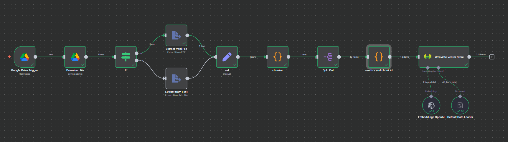

# Part 1 – n8n Workflow Implementation and Vector Database Design

This document explains the **workflow design, strategy, and architectural decisions** for the automated document ingestion and vectorization pipeline built using **n8n** and **Weaviate**.  
It addresses all Part 1 requirementsincluding the workflow diagram, node functionality, format-handling strategy, error-handling design, and a detailed vector-database comparison.

---

##  1. Detailed Workflow Overview

The following figure shows the complete n8n workflow used,.



### 🔹 Workflow Summary
The workflow continuously monitors a Google Drive folder, downloads new documents, extracts readable text, chunks the text into smaller sections, generates vector embeddings using OpenAI’s embedding API, and stores both text and metadata into a **Weaviate** vector database.  
This makes the documents searchable and retrievable for later use in a Retrieval-Augmented Generation (RAG) system.

---

##  2. Node-by-Node Explanation and Configuration

### **1. Google Drive Trigger**
- **Purpose:** Watches a Google Drive folder for new file uploads.  
- **Why used:** Enables real-time, event-based ingestion — no manual uploads or polling scripts needed.  
- **Settings:**  
  - *Event:* `File Created`  
  - *Folder:* `/Inbox`  

### **2. Download File**
- **Purpose:** Downloads the uploaded document binary.  
- **Why used:** Makes the file content available locally within n8n for further extraction.  
- **Settings:**  
  - *File ID:* `{{$json.id}}`  
  - *Binary Property:* `data`

### **3. If (Node Router)**
- **Purpose:** Determines the correct extraction path based on MIME type.  
- **Why used:** PDF and text/Word files require different parsing logic.  
- **Settings:**  
  - *Condition:* `mimeType contains "pdf"`  
  - *True path:* Extract from PDF  
  - *False path:* Extract from Text File

### **4. Extract from File (PDF)**
- **Purpose:** Converts PDF pages to plain text.  
- **Why used:** Converts structured document data into plain text for language-model embedding.  
- **Settings:**  
  - *Mode:* `Extract From PDF`  
  - *Binary Property:* `data`

### **5. Extract from File (Text File)**
- **Purpose:** Reads `.txt` or `.docx` files and extracts text.  
- **Why used:** Ensures consistency for non-PDF formats.  
- **Settings:**  
  - *Mode:* `Extract From Text File`  
  - *Binary Property:* `data`

### **6. Set (Node Manual Fields)**
- **Purpose:** Normalizes extracted fields for downstream nodes.  
- **Why used:** Guarantees uniform metadata across file types.  
- **Settings:**  
  ```json
  {
    "text": "{{$json.text}}",
    "doc_id": "{{$json.id || $json.name}}",
    "source": "{{$json.name}}",
    "mime_type": "{{$json.mimeType}}",
    "page": null
  }

### **7. Chunker (Code Node)**

- **Purpose:** Splits text into overlapping sections for efficient embedding.

- **Why used:** Long documents exceed embedding-model token limits; chunking preserves contextual continuity.

- **Settings:**

- **Chunk size:** 800 characters

- **Overlap:** 120 characters

- **Output:** Array chunks[] = [{text, doc_id, source, mime_type, page}].

### **8. Split Out**

- **Purpose:** Converts chunks[] array into separate items.

- **Why used:** Required so each chunk becomes an individual record for embedding.

- **Settings:** Input Array: {{$json["chunks"]}}

### **9. Sanitize and Add Chunk ID (Code Node)**

- **Purpose:** Cleans and labels each chunk.

- **Why used:** Ensures unique IDs and removes empty entries before indexing.

- **Logic:**

        let i=0;
        return items
        .filter(it => it.json.text?.trim().length > 5)
        .map(it => ({
            json:{
            ...it.json,
            chunk_id: String(i++).padStart(6,'0')
            }
        }));

### **10. Weaviate Vector Store**

- **Purpose:** Inserts each processed text chunk and its corresponding vector embedding into the Weaviate database.  
- **Why used:** Acts as a centralized, high-performance vector store that retains both embeddings and document metadata, enabling fast and accurate semantic similarity search during retrieval.

**Settings:**
- **Operation:** `Insert Documents`  
- **Collection:** `DocChunk`  
- **Text Key:** `text`  
- **Batch Size:** `200`  

**Sub-nodes:**
- **Embeddings (OpenAI):**
  - *Model:* `text-embedding-3-small`  
  - *Purpose:* Converts text chunks into numerical vector representations that capture semantic meaning.  

- **Default Data Loader:**
  - *Text Splitting:* `Simple`  
  - *Metadata Fields:* `doc_id`, `chunk_id`, `source`, `mime_type`, `page`  

This node seamlessly integrates embedding generation and vector upsert into a single operation, avoiding the need for custom HTTP JSON payloads or manual schema management.

---

## 3. Strategy for Handling Different Document Formats

| **Format** | **Extraction Path** | **Description** |
|-------------|---------------------|-----------------|
| **PDF** | “True” branch → Extract from PDF | Native text extraction preserves page layout and section flow. |
| **TXT / DOCX** | “False” branch → Extract from Text File | Reads raw or Word-based textual content directly. |
| **Unsupported** | (Optional future branch) | Can be extended to include OCR for image-based PDFs or CSV parsers for tabular data. |

All extracted text is normalized through the **Set** node into a consistent JSON schema:

        {
        "text": "...",
        "doc_id": "...",
        "source": "...",
        "mime_type": "...",
        "page": null
        }


## 4. Error-Handling and Notification Mechanisms

The workflow has been designed with **production-level fault tolerance** and observability to ensure continuous operation even when errors occur.  
Both **preventive** and **reactive** controls have been implemented to handle data, API, and system-level failures gracefully.

---

### 🛡️ Preventive Controls
| **Control** | **Description** |
|--------------|-----------------|
| **Input Validation** | Custom Code nodes filter out empty, short, or malformed text segments before embedding generation, preventing invalid vectors from reaching Weaviate. |
| **Schema Sanity** | The `page` field is only included when it contains a numeric value to comply with the Weaviate schema (`int` type). This eliminates schema-type errors during batch inserts. |
| **Continue on Fail** | Enabled on the Weaviate Vector Store node so that a single failed chunk will not terminate the entire ingestion workflow. This ensures all valid chunks are still stored successfully. |

---

###  Reactive Controls
| **Control** | **Description** |
|--------------|-----------------|
| **Error Trigger Path** | Any failed insertions are redirected to a dedicated Google Drive folder (`/failed`) for inspection. Optionally, the system can send real-time alerts to Slack or email for immediate awareness. |
| **Retries with Backoff** | Both the OpenAI Embeddings and Weaviate nodes are configured to retry automatically using exponential backoff. This minimizes downtime from transient network or API rate-limit issues. |
| **Archiving of Processed Files** | Once successfully ingested, each file is moved from the `/Inbox` folder to `/processed`. This prevents reprocessing of the same file and maintains a clear audit trail of completed jobs. |

---

###  Observability and Logging
| **Aspect** | **Description** |
|-------------|-----------------|
| **Execution Logs** | n8n logs the number of total chunks, successful inserts, and failed operations per execution. This data provides insight into ingestion health and helps with troubleshooting. |
| **Metadata Traceability** | Each vector record carries `doc_id` and `chunk_id` metadata, providing full traceability between database records and the original source documents. |
| **Monitoring Dashboard (optional)** | The workflow can be extended to push logs or metrics to a dashboard (Grafana, Datadog, or Slack summaries) for ongoing operational visibility. |

---

### Example Notification
>  **RAG Ingestion Failed** – File: *consult_report1.pdf* (3 chunks skipped due to formatting errors)

These mechanisms collectively ensure that the workflow operates reliably in production, supports rapid recovery from errors, and provides complete transparency for debugging and auditing purposes.


##  Vector Database Comparative Analysis

| **Criterion** | **PGVector** | **MongoDB Atlas Vector Search** | **Chroma** | **Weaviate (Chosen)** |
|----------------|---------------|----------------------------------|-------------|-----------------------|
| **Performance** | Moderate performance — depends on PostgreSQL’s IVFFlat or HNSW extensions; suitable for small to medium datasets. | High query speed under managed Atlas infrastructure but dependent on cloud service latency. | Excellent for local or small datasets; fast in-memory retrieval but lacks persistent indexing for large-scale data. | Exceptional performance with built-in **HNSW ANN indexing** and optimized batch ingestion; real-time semantic search. |
| **Scalability** | Scales vertically; sharding and clustering require manual setup. | Horizontal scaling and autoscaling supported natively in MongoDB Atlas; enterprise-grade. | Limited scalability; primarily designed for single-node or local experiments. | Natively supports **horizontal sharding**, clustering, and distributed deployments for large vector datasets. |
| **Integration Complexity** | Requires manual embedding generation and SQL joins; no direct n8n integration. | Needs Atlas configuration, API keys, and cloud dependencies; integration through HTTP API. | Simple Python API for prototypes; lacks official n8n node integration. | Direct **n8n Vector Store node integration**; zero-code embedding and upsert operations; easiest to deploy. |
| **Use-Case Alignment** | Best for applications already using PostgreSQL with moderate vector requirements. | Suitable for enterprise-level projects with managed cloud infrastructure. | Ideal for research, academic, or lightweight local projects. | Perfect for **production-grade RAG systems**, metadata-rich storage, and hybrid (text + vector) retrieval. |
| **Maintenance & Hosting** | Self-hosted; requires manual database tuning and maintenance. | Fully managed service; limited control over backend configuration. | Self-hosted; minimal overhead but lacks fault tolerance. | Flexible — **self-hosted or managed cloud**, containerized with Docker for ease of deployment. |
| **Cost** | Low (open source, uses existing Postgres infra). | Higher (Atlas subscription and storage cost). | Free and open source; limited for production use. | Free for self-host; paid options for managed Weaviate Cloud Service (WCS). |

###  Final Decision: **Weaviate**
**Justification:**
- Provides the **best performance** via native HNSW ANN indexing.  
- Offers **horizontal scalability** and **clustering support** for production workloads.  
- Has **native n8n integration**, removing JSON formatting or API complexity.  
- Ideal for **metadata-rich vector storage** and **RAG (Retrieval-Augmented Generation)** systems.  
- Supports both **OpenAI** and **Hugging Face** embedding models, ensuring flexibility for future model upgrades.
