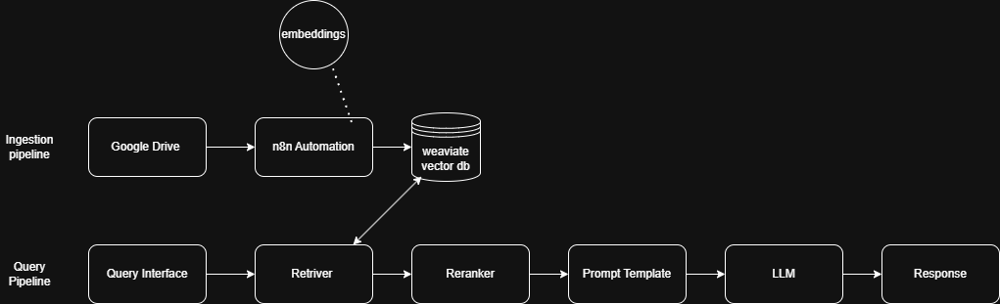

# LangChain Architecture Design

This document details the architecture for the Project Polaris RAG application, covering the high-level design, code structure, prompt engineering principles, and retrieval optimization strategies.

---

## High-Level System Architecture Diagram

---

## Class Structure and Module Organization

### Class Structure

# Prompt Engineering and Retrieval Optimization

## Prompt Engineering and Template Design

Prompt engineering directly affects the quality and safety of RAG answers. The following principles guided the template design:

* **System Prompt**: The system message instructs the model that it is a "helpful consultant" who must answer **only from the provided context**. It warns the model to respond with “I cannot answer based on the given documents” if the answer is not contained. This mitigates hallucinations and encourages the LLM to admit when information is missing. The prompt also instructs the model to cite source IDs for transparency.

* **Context Injection**: Retrieved chunks are concatenated with a clear header (e.g., `Context:`) and separated by blank lines. Each chunk is prefixed with its source ID (e.g., `document.pdf#chunk3`) to allow the model to provide citations in the answer.

* **Question/Answer Separation**: After the context, the prompt includes a `Question:` followed by the user’s query and ends with `Answer:` to clearly demarcate the expected completion.

* **Temperature and Model Selection**: A low **temperature (0–0.1)** is used for factual QA to reduce randomness. For summarisation, a slightly higher temperature can produce more varied summaries. The underlying model can be **GPT-3.5 Turbo** for cost-efficiency or **GPT-4** for higher quality. Recent benchmarks show that open-source Llama-2 70B models achieve similar factual consistency to GPT-4 (81.7% vs. 85.5%) but GPT-4 still leads in overall scores and longer context handling. The firm can evaluate both; for this prototype we default to GPT-3.5 Turbo and allow switching to GPT-4 via configuration.

---

## Retrieval Optimisation Strategies

High-quality retrieval is essential for accurate answers. The system implements several strategies to optimise retrieval quality:

* **Chunk Size and Overlap**: Choosing an appropriate chunk size is crucial. Too small and the context may be incomplete; too large and the retrieval may miss relevant information. LlamaIndex’s experiments show that around **512 tokens with an overlap of 64 tokens** provides a good trade-off between granularity and context coverage. These values are configurable in the `Chunker` class.

* **Metadata Filtering**: Each chunk stores metadata (source file name and chunk index). Filters (e.g., by source or date) can be applied in the vector query to restrict results to relevant documents, reducing noise.

* **Top-k Tuning**: Retrieval returns more chunks than are used in the final prompt (e.g., retrieve `top_k*2` and then rerank down to `top_k`). This ensures that the reranker has a larger candidate pool and reduces the risk of missing relevant chunks.

* **Reranking**: The **cross-encoder reranker** scores each query–document pair jointly, capturing word-level interactions and improving relevance. According to research, cross-encoders can improve retrieval accuracy by **20–35%** compared with pure dense retrieval, although they add 200–500 ms latency per query. The system allows reranking to be toggled; for interactive chat the latency trade-off may be acceptable, but it can be disabled for faster responses.

* **Embedding Model Choice**: OpenAI’s **`text-embedding-3-large`** offers 3072-dimensional vectors and supports up to 8192 tokens input, achieving state-of-the-art MTEB scores. However, a proprietary model may not be suitable for all use cases. Alternatives like **BGE-M3** (dense + sparse retrieval) are open-source and can be swapped into the `EmbeddingGenerator` class. The design allows injecting any embedding model that returns vectors.

* **Caching and Indexing**: Embeddings and summaries can be cached to avoid recomputation. Vector databases like Weaviate also support **hybrid (dense + BM25) search** and live schema updates, which can further enhance retrieval quality.